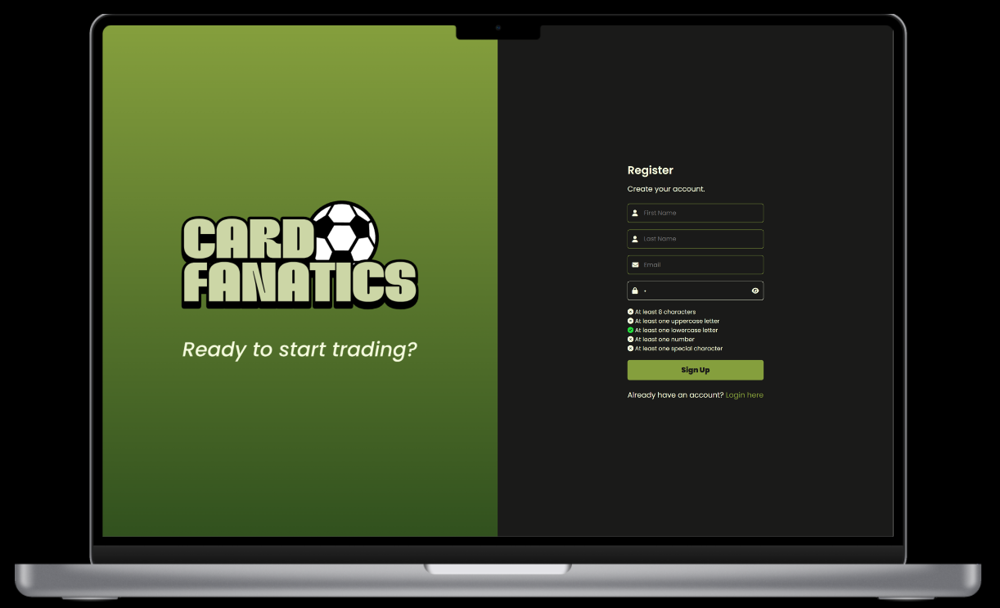
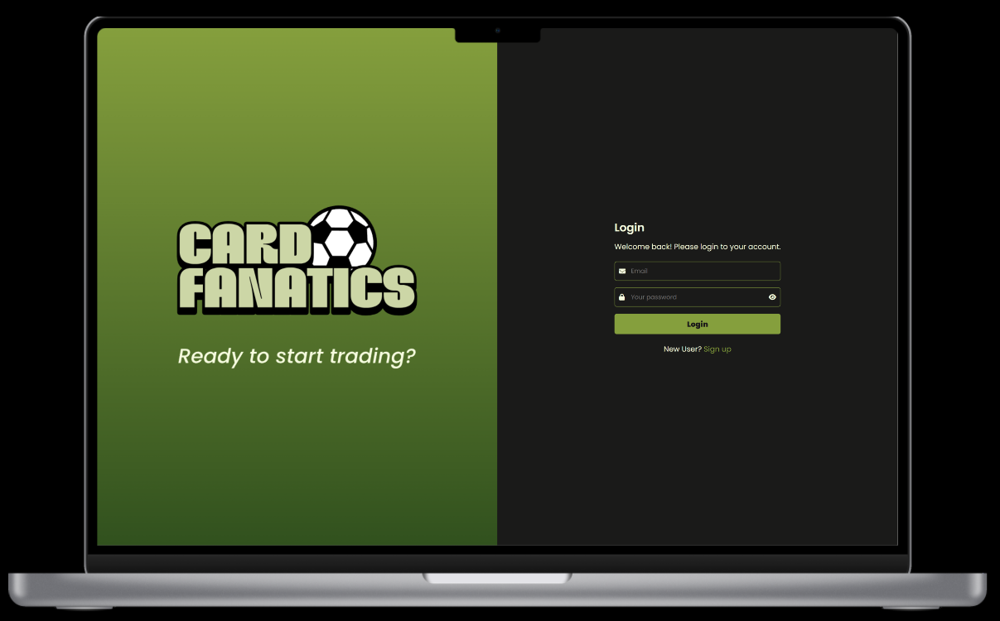
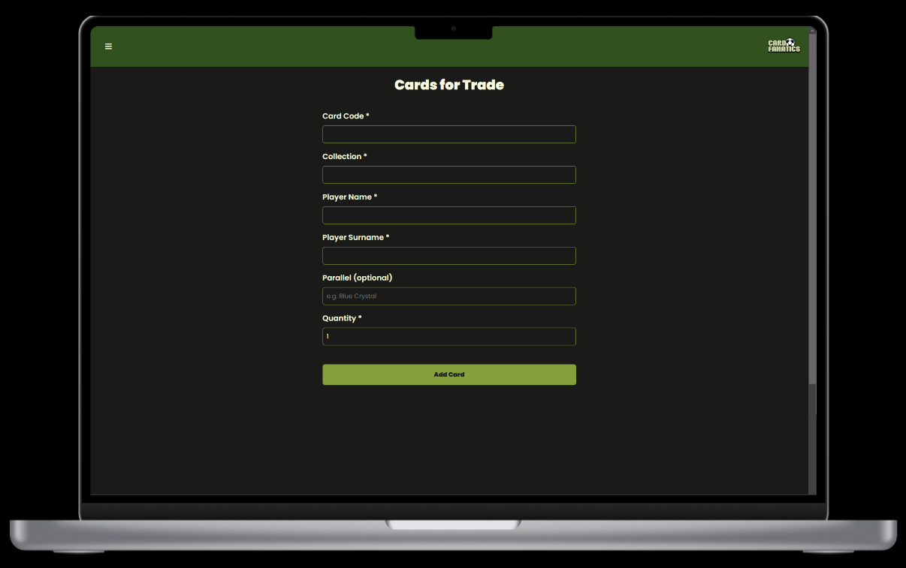
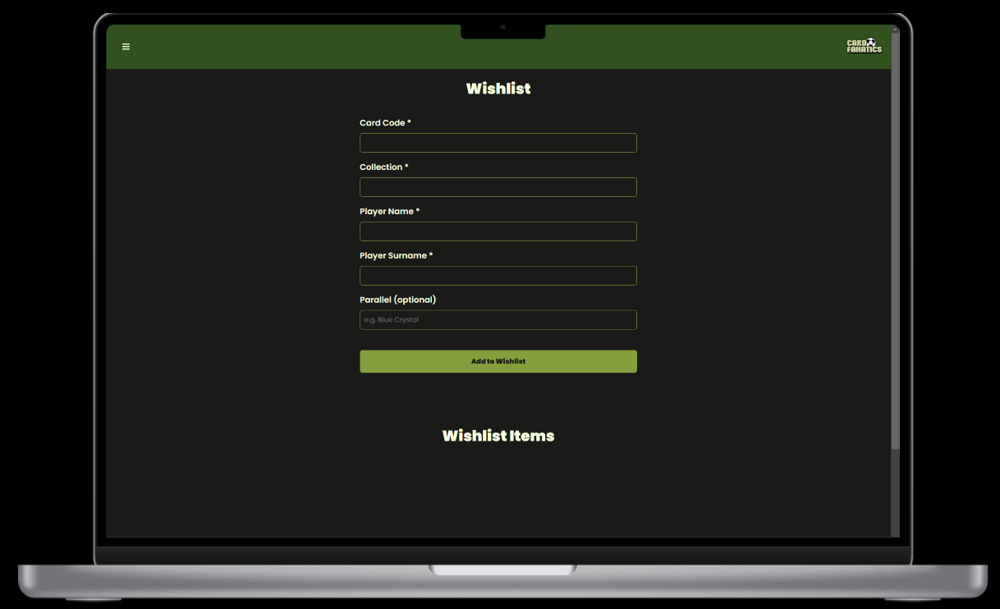
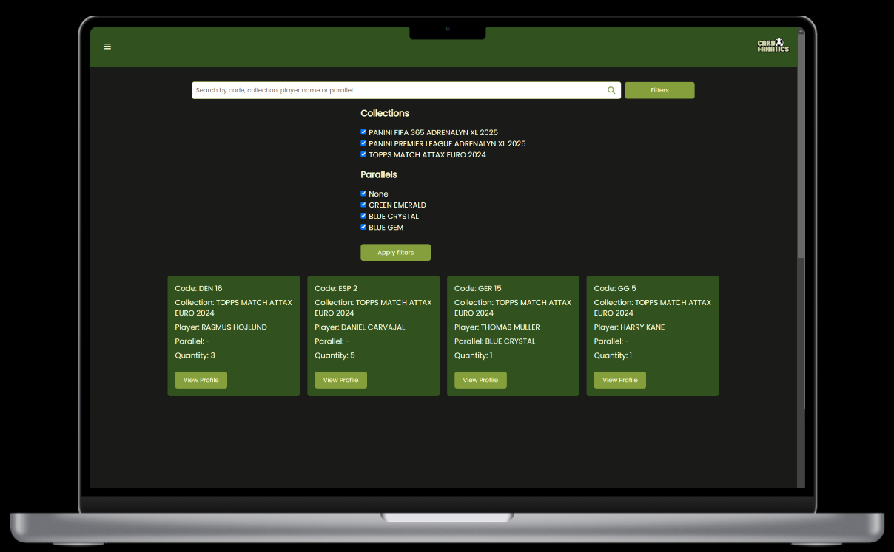
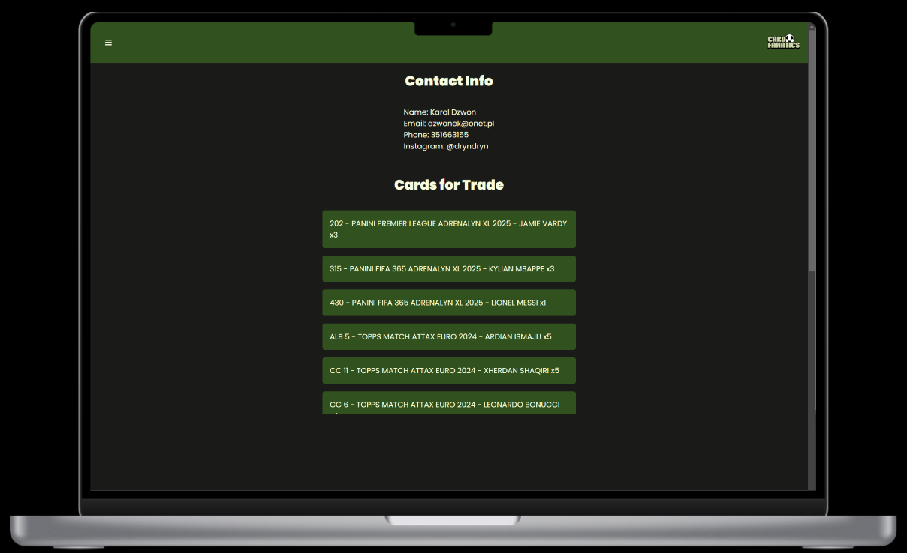
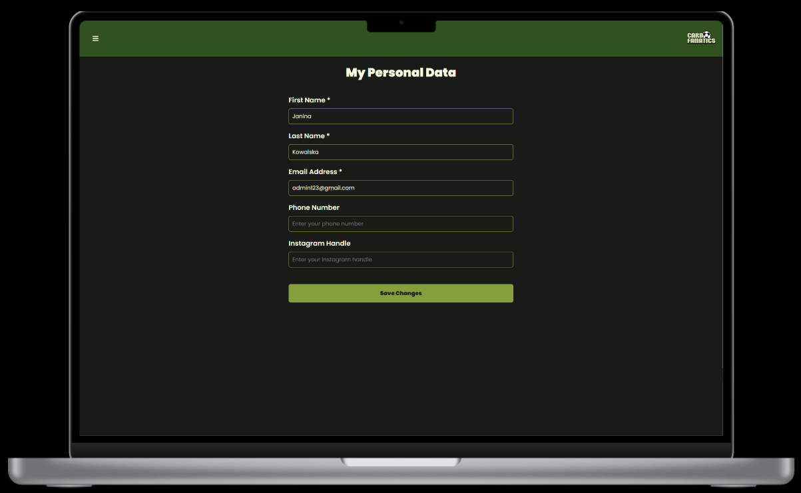
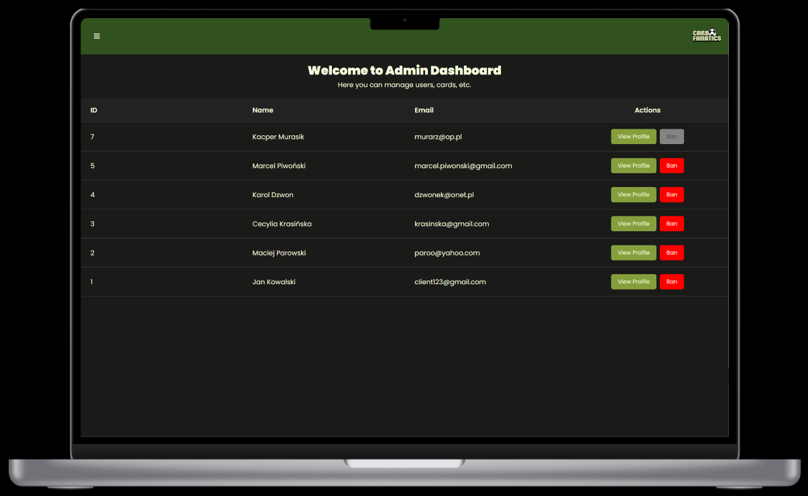
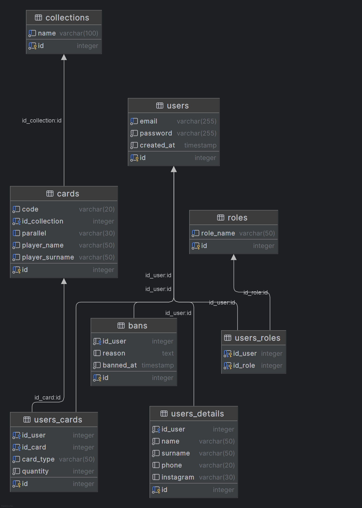

**Card Fanatics** is a web application for managing soccer trading cards and connecting collectors for potential
exchanges. This README provides setup instructions, feature summaries, usage flows, and a brief overview of the database
schema.

---

## Table of Contents

1. [Overview](#overview)
2. [Features](#features)
3. [Database Schema](#database-schema)
4. [Getting Started](#getting-started)
5. [Default Test Accounts](#default-test-accounts)

---

## Overview

**Card Fanatics** enables you to:

- **Register and log in** securely (hashed passwords in PostgreSQL).
- **Add, remove, or update cards** in two lists:
    - *Cards for Trade*: cards you offer to others,
    - *Wishlist*: cards you’re seeking to acquire.
- **Search** among other users’ trade lists by card code, player name, collection name, or parallel.
- **View user profiles** (contact info, their trade and wishlist items).
- **Ban users** (if you have admin rights), removing their cards and blocking their login.

The application uses **PHP 7.4**, **PostgreSQL 15**, and **Nginx** with **Docker Compose**. The front end is built with
**HTML/CSS/JavaScript** (Fetch API).

---

## Features

1. **Register / Log In**
    - Create a user account; credentials are stored hashed.
    - Session-based auth sets a `user_id` upon successful login.  
      **Desktop View**  
      
        
      **Mobile View**  
      .png)
      .png)

2. **Cards for Trade**
    - Add a card (code, collection, player name, optional parallel, quantity).
    - Update quantity or remove an entry anytime.  
      **Desktop View**  
        
      **Mobile View**  
      .png)

3. **Wishlist**
    - Add cards you want; remove them when no longer needed.  
      **Desktop View**  
        
      **Mobile View**  
      .png)

4. **Card Search**
    - Browse other users’ trade cards (excluding your own).
    - Apply filters (collection, parallel).  
      **Desktop View**  
        
      **Mobile View**  
      .png)

5. **View User Profiles**
    - Access other users’ contact info and see their trade/wishlist.  
      **Desktop View**  
        
      **Mobile View**  
      .png)

6. **Profile Management**
    - *My Personal Data*: edit name, surname, phone, Instagram.
   
      **Desktop View**  
        
      **Mobile View**  
      .png)

7. **Admin Dashboard**
    - Lists all users; ban if necessary.
    - Banning removes a user’s cards from the DB and blocks their login.  
      **Desktop View**  
        
      **Mobile View**  
      .png)

---

## Database Schema

Below is a conceptual overview of the main tables:

- **users**  
  Stores basic login credentials (`email`, `password`, `created_at`). Each user has a unique ID.

- **users_details**  
  Extends user info 1:1 with `users` (name, surname, phone, Instagram).

- **collections**  
  Lists distinct card sets (e.g., “TOPPS MATCH ATTAX EURO 2024”). Each collection has a unique name.

- **cards**  
  Belongs to a collection and includes fields like `code`, `parallel`, and the player’s name/surname. Unique constraint prevents duplicates.

- **users_cards**  
  Associates users with specific cards for two types: `trade` (offered) or `wishlist` (wanted). Each record tracks `quantity`.

- **roles** and **users_roles**  
  Defines possible roles (e.g., “user,” “admin”) and a many-to-many mapping of users to roles.

- **bans**  
  Logs banned users with a `reason` and timestamp (`banned_at`). A user’s banned entry removes their cards and prevents login.

Additional logic: a **trigger** prevents removing the mandatory “user” role, ensuring no user is left role-less.

Below is a conceptual entity-relationship diagram of the core tables:


---

## Getting Started

1. **Clone the Repository**

   ```bash
   git clone https://github.com/mjkj09/Card-Fanatics.git
   cd Card-Fanatics
   ```

2. **Run Docker**

   ```bash
   docker compose up --build -d
   ```
    This spins up three containers:
   - **db** (PostgreSQL)
   - **php** (PHP-FPM for running PHP code)
   - **web** (Nginx on port 8080)

3. **Access the App**

    - In your browser, go to http://localhost:8080. 

    - You should see the login or main page.

4. **Stop / Remove Containers**

   ```bash
   docker compose stop
   ```
   halts the containers (without removing them).

   ```bash
   docker compose down -v
   ```
   removes containers and volumes, clearing any DB data.

---

## Default Test Accounts

| **Role** | **Email**           | **Password** |
|----------|---------------------|--------------|
| Admin    | admin123@gmail.com  | Admin123!    |
| User     | client123@gmail.com | Client123!   |

Use these to see admin privileges (ban, user management) vs. normal user behavior.

---

Author: Mikołaj Munik

Enjoy collecting and trading!

